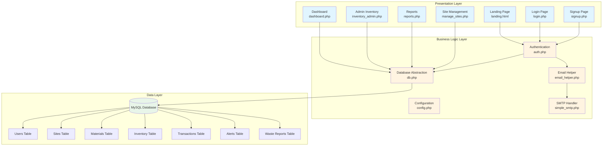
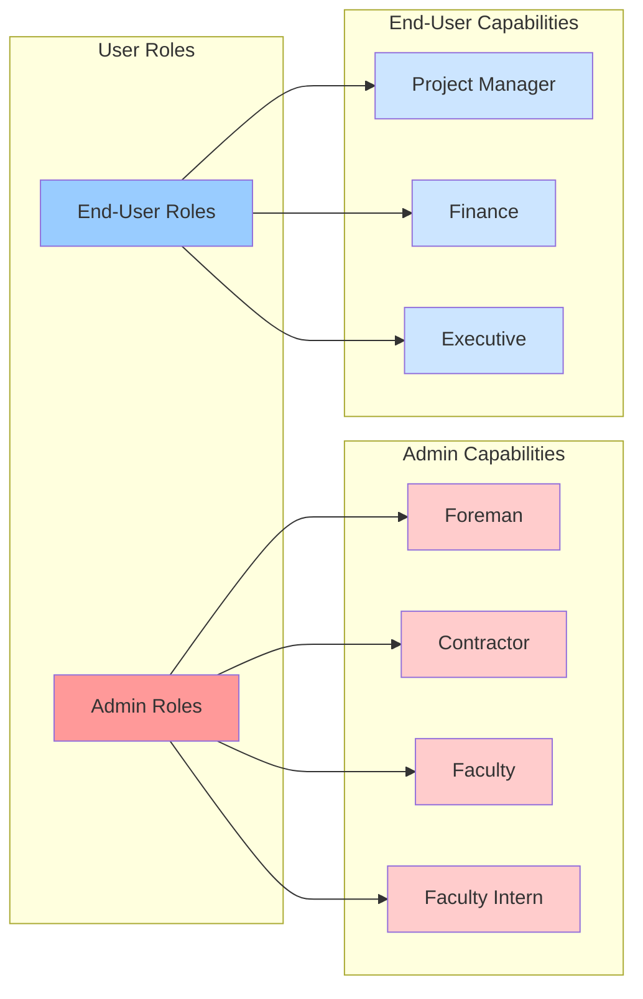
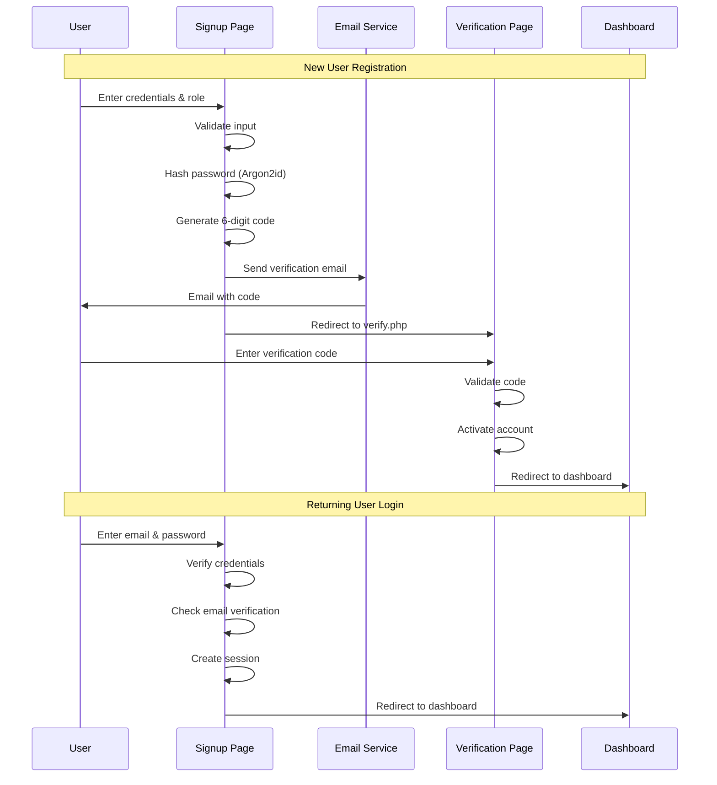

# CORNERSTONE Inventory Tracker
## Formal Project Report

---

## Executive Summary

**CORNERSTONE Inventory Tracker** is a comprehensive web-based inventory management system designed specifically for multi-site construction projects. The system provides real-time inventory tracking, automated alerts, predictive reordering, and detailed reporting capabilities to optimize material management across construction sites.

**Project Status:** Production-Ready  
**Development Period:** December 2025  
**Repository:** [NanaKY931/CORNERSTONE](https://github.com/NanaKY931/CORNERSTONE)

---

## 1. Problem Statement

Construction projects face significant challenges in managing inventory across multiple sites:

- **Material Waste:** Lack of real-time visibility leads to over-ordering and material shrinkage
- **Project Delays:** Insufficient materials cause work stoppages and schedule overruns
- **Cost Overruns:** Poor inventory management results in unnecessary expenses
- **Limited Visibility:** Project managers and executives lack centralized oversight of material costs
- **Manual Tracking:** Paper-based or spreadsheet systems are error-prone and inefficient

**CORNERSTONE** addresses these challenges by providing a centralized, role-based inventory management platform that enables real-time tracking, automated alerts, and data-driven decision making.

---

## 2. Target Market

### Primary Users

1. **Construction Contractors & Foremen** (Admin Role)
   - Manage day-to-day inventory operations
   - Record material transactions (IN, OUT, TRANSFER)
   - Update site status and material levels

2. **Project Managers** (End-User Role)
   - Monitor inventory across all sites
   - Review cost reports and variance analysis
   - Make procurement decisions based on real-time data

3. **Finance Teams** (End-User Role)
   - Track total material costs
   - Analyze spending by site and category
   - Generate financial reports for stakeholders

4. **Executive Leadership** (End-User Role)
   - High-level visibility into project status
   - Strategic decision-making based on inventory metrics
   - Risk assessment through variance reports

### Market Segment

- **Industry:** Construction & Building
- **Project Size:** Medium to large-scale construction projects with multiple sites
- **Geographic Focus:** Projects requiring centralized oversight of distributed locations
- **Company Size:** Construction firms managing 3+ concurrent project sites

---

## 3. Technology Stack

### Frontend Technologies
```
- HTML5: Semantic markup and structure
- CSS3: Custom styling with modern design patterns
- JavaScript (ES6+): Client-side interactivity and form validation
- SVG: Scalable vector graphics for icons and visualizations
```

### Backend Technologies
```
- PHP 7.4+: Server-side logic and business rules
- MySQL 8.0+: Relational database management
- Apache/XAMPP: Web server environment
- .htaccess: URL rewriting and routing
```

### Security Features
```
- CSRF Protection: Token-based request validation
- Password Hashing: Argon2id algorithm (industry standard)
- Session Management: Secure session handling with regeneration
- Input Sanitization: XSS prevention and SQL injection protection
- Email Verification: Two-factor authentication for new accounts
```

### Email Services
```
- Gmail SMTP: Email delivery for verification codes
- Custom SMTP Library: simple_smtp.php for email handling
- PHPMailer: Alternative email library support
```

### Development Tools
```
- Git: Version control
- GitHub: Repository hosting and collaboration
- VS Code: Primary development environment
```

---

## 4. System Architecture

### 3-Tier Architecture

The CORNERSTONE system follows a classic 3-tier architecture pattern:



### Layer Responsibilities

**Presentation Layer:**
- User interface rendering
- Client-side validation
- User interaction handling
- Responsive design implementation

**Business Logic Layer:**
- Authentication and authorization
- CSRF protection
- Database query abstraction
- Email notification handling
- Business rule enforcement

**Data Layer:**
- Persistent data storage
- Relational data integrity
- Transaction management
- Query optimization

---

## 5. User Roles & Authentication Flow

### Role-Based Access Control



### Authentication & Signup Flow



### Feature Access by Role

```mermaid
graph TB
    subgraph "Admin Features"
        AF1[✓ View Dashboard]
        AF2[✓ View Reports]
        AF3[✓ Manage Inventory]
        AF4[✓ Record Transactions]
        AF5[✓ Manage Sites]
        AF6[✓ Transfer Materials]
    end
    
    subgraph "End-User Features"
        EF1[✓ View Dashboard]
        EF2[✓ View Reports]
        EF3[✗ Manage Inventory]
        EF4[✗ Record Transactions]
        EF5[✗ Manage Sites]
        EF6[✗ Transfer Materials]
    end
    
    A[Admin User] --> AF1
    A --> AF2
    A --> AF3
    A --> AF4
    A --> AF5
    A --> AF6
    
    E[End User] --> EF1
    E --> EF2
    E --> EF3
    E --> EF4
    E --> EF5
    E --> EF6
    
    style A fill:#ff9999
    style E fill:#99ccff
    style AF1 fill:#90EE90
    style AF2 fill:#90EE90
    style AF3 fill:#90EE90
    style AF4 fill:#90EE90
    style AF5 fill:#90EE90
    style AF6 fill:#90EE90
    style EF1 fill:#90EE90
    style EF2 fill:#90EE90
    style EF3 fill:#FFB6C1
    style EF4 fill:#FFB6C1
    style EF5 fill:#FFB6C1
    style EF6 fill:#FFB6C1
```



---

## 6. Core Features

### 6.1 Dashboard (All Users)

**Purpose:** Centralized overview of multi-site inventory status

**Key Features:**
- Real-time inventory statistics across all sites
- Active alerts for low stock and predictive reordering
- Site status cards with completion percentages
- Multi-site inventory table with filtering capabilities
- Total inventory value calculation
- Stock status indicators (In Stock, Low Stock, Out of Stock)

**Technical Implementation:**
- Dynamic data aggregation from multiple tables
- Client-side search and filtering
- Responsive grid layout for site cards
- Color-coded status badges

---

### 6.2 Inventory Management (Admin Only)

**Purpose:** Record and track material transactions

**Transaction Types:**
1. **IN:** Add materials to site inventory
2. **OUT:** Remove materials from site inventory
3. **TRANSFER:** Move materials between sites

**Key Features:**
- Site-specific inventory views
- Material selection by category
- Quantity validation
- Transaction notes and audit trail
- Real-time inventory updates
- Recent transaction history
- Current inventory levels display

**Technical Implementation:**
- Database transactions for data integrity
- CSRF protection on all forms
- Optimistic locking for concurrent updates
- Audit logging for all transactions

---

### 6.3 Site Management (Admin Only)

**Purpose:** Manage construction site information

**Key Features:**
- Create, update, and delete sites
- Site status management (Active, Completed, Halted, etc.)
- Location and completion tracking
- Estimated completion dates
- Site-specific inventory overview

**Status Options:**
- Active
- Completed
- Halted - Insufficient Materials
- Halted - Weather
- Halted - Other

---

### 6.4 Reports & Analytics (All Users)

**Purpose:** Generate actionable insights from inventory data

**Report Types:**

#### 6.4.1 Total Material Cost Report
- Inventory value by site
- Inventory value by category
- Detailed material breakdown
- CSV export capability

#### 6.4.2 Waste & Variance Report (Shrinkage Audit)
- Expected vs. actual quantity comparison
- Variance percentage calculation
- Value lost due to waste/theft
- High variance threshold alerts (>15%)
- Date range filtering
- CSV export capability

#### 6.4.3 Predictive Reorder Report
- Materials below reorder threshold
- Shortage calculations
- Estimated reorder costs
- Site-specific reorder needs
- CSV export capability

**Technical Implementation:**
- Dynamic SQL query generation
- Server-side CSV generation
- Chart visualizations with percentage bars
- Customizable date ranges and filters

---

### 6.5 Authentication & Security

**Features:**
- Email-based signup with verification
- 6-digit verification code system
- Password hashing with Argon2id
- CSRF token protection
- Session management with regeneration
- Role-based access control
- Secure logout with session destruction
- Account deletion with data cleanup

**Email Verification Flow:**
1. User signs up with email and password
2. System generates 6-digit code
3. Code sent via Gmail SMTP
4. User enters code on verification page
5. Account activated upon successful verification

---

### 6.6 Alert System

**Purpose:** Proactive notification of inventory issues

**Alert Types:**
1. **Low Stock Alerts:** Triggered when quantity falls below reorder threshold
2. **Predictive Reorder Alerts:** Forecasted shortages based on usage patterns
3. **Out of Stock Alerts:** Zero quantity notifications

**Features:**
- Automatic alert generation
- Alert resolution tracking
- Site and material-specific alerts
- Visual alert indicators on dashboard
- Alert count badges

---

## 7. Testing Scenarios

During development, the following test scenarios were executed using test files:

### 7.1 Email Verification Testing
**Test File:** `test_mercury_email.php`

**Scenarios Tested:**
- SMTP connection to Gmail servers
- Verification code generation
- Email delivery success/failure
- HTML email formatting
- Error handling for invalid credentials

**Results:** ✓ Successfully delivered verification emails with 6-digit codes

---

### 7.2 Password Hashing Testing
**Test File:** `generate_hash.php`

**Scenarios Tested:**
- Argon2id hash generation
- Hash verification
- Password strength validation
- Hash uniqueness for same password

**Results:** ✓ Confirmed secure password hashing with Argon2id algorithm

---

### 7.3 User Role Testing
**Test File:** `dummy_users.sql`

**Scenarios Tested:**
- Admin role signup (Foreman, Contractor, Faculty, Faculty Intern)
- End-user role signup (Project Manager, Finance, Executive)
- Role-based page access restrictions
- Navigation menu visibility by role
- Feature availability by role

**Results:** ✓ All roles properly restricted access to appropriate features

---

### 7.4 Transaction Testing

**Scenarios Tested:**
- IN transaction: Adding materials to inventory
- OUT transaction: Removing materials with insufficient quantity validation
- TRANSFER transaction: Moving materials between sites
- Concurrent transaction handling
- Transaction rollback on errors

**Results:** ✓ All transaction types executed correctly with proper validation

---

### 7.5 Report Generation Testing

**Scenarios Tested:**
- Cost report with multi-site data
- Waste report with variance calculations
- Reorder report with threshold detection
- CSV export for all report types
- Date range filtering for waste reports

**Results:** ✓ Reports generated accurately with correct calculations and CSV export

---

## 8. Database Schema

### Core Tables

**users**
- Authentication and user profile data
- Role-based access control
- Email verification status

**sites**
- Construction site information
- Status and completion tracking
- Location data

**materials**
- Material catalog
- Unit costs and measurements
- Reorder thresholds

**inventory**
- Current stock levels by site and material
- Last updated timestamps
- Composite primary key (site_id, material_id)

**transactions**
- Complete audit trail of all inventory changes
- User attribution
- Transaction types (IN, OUT, TRANSFER_IN, TRANSFER_OUT)
- Related site tracking for transfers

**alerts**
- Active and resolved alerts
- Alert types and messages
- Site and material associations

**waste_reports**
- Variance tracking
- Expected vs. actual quantities
- Shrinkage audit data

---

## 9. Key Achievements

### Technical Excellence
✓ Secure authentication with industry-standard Argon2id hashing  
✓ CSRF protection on all state-changing operations  
✓ Role-based access control with granular permissions  
✓ Database transaction support for data integrity  
✓ Email verification system with Gmail SMTP integration  

### User Experience
✓ Responsive design for desktop and tablet devices  
✓ Intuitive navigation with role-specific menus  
✓ Real-time inventory updates  
✓ Advanced filtering and search capabilities  
✓ Visual status indicators and alerts  

### Business Value
✓ Multi-site inventory visibility  
✓ Automated low-stock alerts  
✓ Predictive reordering capabilities  
✓ Comprehensive reporting and analytics  
✓ Audit trail for compliance  
✓ CSV export for external analysis  

---

## 10. Future Enhancements

### Potential Improvements
- Mobile application for on-site inventory updates
- Barcode/QR code scanning for materials
- Advanced analytics with trend analysis
- Automated purchase order generation
- Supplier integration
- Real-time notifications via SMS/push notifications
- Multi-language support
- Advanced user permissions (custom roles)
- Integration with accounting systems
- Mobile-responsive design optimization

---

## 11. Conclusion

**CORNERSTONE Inventory Tracker** successfully addresses the critical challenges of multi-site construction inventory management through a secure, scalable, and user-friendly web application. The system's role-based architecture ensures that each stakeholder has access to the tools and information they need, while comprehensive reporting capabilities enable data-driven decision making.

The project demonstrates best practices in web application development, including secure authentication, database design, and user experience design. With its robust feature set and proven testing results, CORNERSTONE is production-ready and positioned to deliver significant value to construction organizations managing complex, multi-site projects.

---

**Document Version:** 1.0  
**Last Updated:** December 19, 2025  
**Prepared By:** CORNERSTONE Development Team
